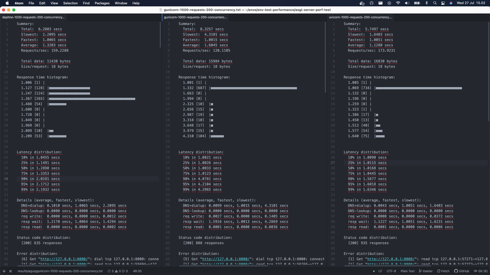

## Daphne & Uvicorn Performance Test

### How the test done ?
```
There are 2 types of test, high request & high concurrency + request

-- high request will test the app with 50 concurrency with total request of 1000
-- high concurrency + request will test the app with 200 concurrency with total request of 1000
```

### How to run the test ?

-- Required App:
```
> hey. ref: https://github.com/rakyll/hey
> python
> pipenv
```

-- Setup App
```
> pipenv install
```

-- Running Test
```
1) run the app
> make daphne  <--- this will run app using daphne
or
> make uvicorn  <--- this will run app using uvicorn


2) run the test
> make test-req  <--- this will run high request test
or
> make test-req-con  <--- this will run high request + concurrency test
```

### Results
```
detail of test can be seen here: https://github.com/naufalafif/asgi-server-perf-test/tree/master/results

summary:
both can give good response time. but daphne fail when recieve high concurrency

daphne is good at making sure response time spread equaly. but fail when handling high concurrency, 30% failure on 1000 request & 200 concurrency.
uvicorn is decent at making sure response time spread equaly. & able to handle high concurrency.
```


